# Farmer Application – Voice-First System Architecture (No Login, Multi-Language)

**Fully integrated AI Voice Assistant | English, Hindi, Telugu | No authentication | Voice-only lifecycle**

---

## 1. End-to-End Voice-Only Lifecycle (Sequential Flow)

---

## 2. Detailed Voice Pipeline (Step-by-Step)

```mermaid
flowchart TB
    subgraph Entry["🎤 ENTRY POINT – Voice Commands (No Login)"]
        V1["EN: What is today's tomato price?"]
        V2["HI: आज मेरे जिले की मौसम रिपोर्ट बताओ"]
        V3["TE: నా భూమికి సరిపోయే పంట ఏది?"]
    end

    subgraph VoiceCapture["Voice Capture Interface"]
        MIC[Microphone - Mobile/Web]
        VAD[Voice Activity Detection]
    end

    subgraph LangSpeech["Language & Speech"]
        LID[Automatic Language Detection Engine]
        STT[Multi-Language Speech-to-Text]
        NF[Noise Filtering & Accent Normalization]
    end

    subgraph Understanding["Natural Language Understanding"]
        IC[Intent Classification]
        EE[Entity Extraction]
    end

    subgraph Orchestration["AI Orchestration (No Login)"]
        LLM[LLM-based AI Agent]
        SCM[Session Context Manager - Anonymous]
        CONV[Conversational Memory]
        LOC[Location-Based Intelligence]
    end

    subgraph Routing["Intent Router"]
        ROUTER[Route by Intent]
    end

    subgraph Gateway["API Layer"]
        GW[API Gateway]
        LB[Load Balancer]
        CACHE[Caching Layer]
    end

    subgraph Services["Backend Microservices"]
        CS[Crop Service]
        WS[Weather Service]
        MS[Market Service]
        FS[Finance Service]
        KS[Knowledge Service]
        MAP[Map/Location Service]
    end

    subgraph Data["Data & External APIs"]
        DB[(Databases)]
        EXT[External APIs - Agmarknet, IMD, etc.]
    end

    subgraph Compose["Response Pipeline"]
        COMP[AI Response Composer]
        TRANS[Language Translation Layer]
        TTS[TTS - English / Hindi / Telugu]
    end

    Entry --> MIC --> VAD --> LID --> STT --> NF --> IC --> EE
    EE --> LLM --> SCM --> ROUTER --> GW --> LB
    LB --> CACHE
    CACHE --> CS & WS & MS & FS & KS & MAP
    CS & WS & MS & FS & KS & MAP --> DB & EXT
    DB & EXT --> COMP --> TRANS --> TTS --> FARMER[Farmer hears response]
    SCM --> CONV
    SCM --> LOC
```

---

## 3. Voice-Accessible Features (Intent → Service Mapping)

| Feature | Voice Intent Examples | Backend Service | Notes |
|--------|------------------------|-----------------|--------|
| **Crop Prices** | "What is tomato price?", "चावल की कीमत?" | Crop Service | Agmarknet/Govt API |
| **Weather** | "मौसम रिपोर्ट बताओ", "Weather today?" | Weather Service | IMD/OpenWeather |
| **Buy & Sell Crops** | "I want to sell paddy", "Buy tomato" | Market Service | Listings, contact |
| **Cattle & Pets** | "Sell buffalo", "Buy goats" | Market Service | Livestock listings |
| **Agri Tools** | "Rent tractor", "Sprayer available?" | Market Service | Tools, booking |
| **Technicians** | "Find electrician for pump", "Technician near me" | Knowledge / Map Service | Directory, location |
| **AI Prediction** | "Best crop for my soil?", "Yield prediction" | Knowledge Service + LLM | AI + rules |
| **Soil Test** | "Soil test report", "Recommend crop for my soil" | Knowledge Service | Reports, recommendations |
| **Government Schemes** | "Govt schemes for farmers", "Subsidy eligibility" | Finance / Knowledge Service | Schemes DB |
| **Agri Officers** | "Contact agriculture officer", "Officer in my district" | Knowledge Service | Directory |
| **Loans** | "Loan eligibility", "KCC loan" | Finance Service | Banks, EMI |
| **Land Rent** | "Rent out land", "Land for rent" | Market Service | Land listings |
| **Agri Invest** | "Investment opportunities", "Farmer seeking investor" | Finance / Market Service | Proposals |
| **Farm Work** | "Post job", "Find farm workers" | Market Service | Jobs |
| **FF Seeds** | "Seed catalog", "Order seeds" | Market Service | Catalog, orders |
| **Farmer Guide** | "How to grow paddy?", "Organic farming tips" | Knowledge Service | CMS, multilingual |
| **Weekend Farm** | "Book weekend farm", "Farming experience" | Market Service | Bookings |
| **Classes** | "Farming classes", "Enroll in course" | Knowledge Service | Courses, enrollment |
| **Calculator** | "Fertilizer for 2 acres", "Profit calculator" | Knowledge Service | In-app calc engine |
| **Rewards** | "My points", "Redeem rewards" | Finance / Session | Points, redemption |
| **Map View** | "Farms near me", "Markets in district" | Map Service | OSM/Google, markers |

---

## 4. Session & Identity (No Login)

- **Temporary voice session**: Created on first utterance; expires after inactivity (e.g. 30 min).
- **Conversational memory**: Last few turns kept in session for follow-up questions (no login DB).
- **Location**: From “my district” in voice or device GPS; used for weather, prices, schemes, officers.

---

## 5. Scalability & Reliability

| Component | Role |
|-----------|------|
| **API Gateway** | Single entry, routing, auth (optional), rate limit. |
| **Load Balancer** | Distribute voice and agent traffic. |
| **Caching Layer** | Cache crop prices, weather, scheme list by location. |
| **Microservices** | Crop, Weather, Market, Finance, Knowledge, Map. |
| **Cloud AI Services** | STT, TTS, LLM (e.g. Whisper, multilingual TTS, GPT/Claude). |
| **Error Handling** | Timeouts, retries, fallback answers. |
| **Voice Fallback** | “Sorry, I couldn’t get prices. Try again or say your district.” |
| **Offline / Low-Network** | “Connectivity is low. I’ll answer from cached data.” or queue and retry. |
| **Analytics / Logging** | Anonymized intents, success/failure, latency (no PII). |

---

## 6. Voice Command Examples at Entry Point

| Language | Example Command | Intent |
|----------|-----------------|--------|
| **English** | What is today’s tomato price? | Crop Prices |
| **English** | Weather in my district. | Weather |
| **English** | Which crop suits my land? | AI Prediction / Soil |
| **Hindi** | आज मेरे जिले की मौसम रिपोर्ट बताओ | Weather |
| **Hindi** | चावल की कीमत क्या है? | Crop Prices |
| **Hindi** | सरकारी योजना बताओ | Government Schemes |
| **Telugu** | నా భూమికి సరిపోయే పంట ఏది? | AI Prediction / Soil |
| **Telugu** | ఈ రోజు వేరుకెల ఎంత? | Crop Prices |
| **Telugu** | వాతావరణ సమాచారం చెప్పండి | Weather |

---

## 7. AI Agent Flow (Intent → Data → Response)

---

## 8. Summary Diagram – Full System

---

This document describes a **voice-first, no-login, multi-language (English, Hindi, Telugu)** architecture for the Farmer Application, with all listed features accessible via voice, session and location-based context, and scalable backend and reliability components.
